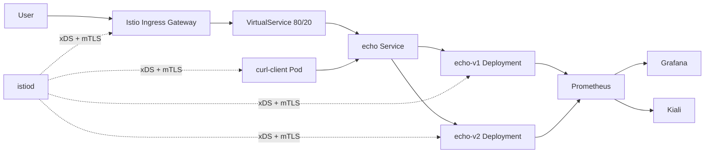

# Istio POC

Small sample app for trying Istio traffic management and mTLS in Kubernetes.

## Architecture



## Assumptions

- Kubernetes 1.25 or newer.
- Istio is installed before applying `istio/sample-echo`.
- Namespace is `istio-poc`.
- Deployment method is raw YAML with Kustomize.
- This is a dev POC, not production.
- Pod Security is set to `enforce: privileged` for this local POC because non-CNI Istio sidecar injection adds an `istio-init` container with `NET_ADMIN`/`NET_RAW`. `warn` and `audit` remain `restricted`.

## Files

- `apps/sample-echo`: namespace, `echo-v1`, `echo-v2`, internal service, and curl client.
- `istio/sample-echo`: gateway, virtual service, destination rule, and strict mTLS policy.
- `observability`: Helm values for Prometheus, Grafana, and Kiali.

## Deploy

```sh
kubectl apply -k apps/sample-echo
kubectl apply -k istio/sample-echo
```

## Test Internal Traffic

```sh
kubectl -n istio-poc wait --for=condition=available deploy/echo-v1 --timeout=120s
kubectl -n istio-poc wait --for=condition=available deploy/echo-v2 --timeout=120s
kubectl -n istio-poc wait --for=condition=available deploy/curl-client --timeout=120s
kubectl -n istio-poc exec deploy/curl-client -c curl -- curl -s http://echo
```

## Test Ingress Traffic

For a local Istio install with port-forward:

```sh
kubectl -n istio-system port-forward svc/istio-ingressgateway 8080:80
curl -s http://localhost:8080/
```

Run the curl command multiple times. The expected result is mostly `hello from echo v1` with some `hello from echo v2` because the route is weighted 80/20.

## Validate

```sh
kubectl kustomize apps/sample-echo
kubectl kustomize istio/sample-echo
kubectl apply -k apps/sample-echo --dry-run=server
kubectl apply -k istio/sample-echo --dry-run=server
kubectl -n istio-poc get pods,svc
kubectl -n istio-poc get gateway,virtualservice,destinationrule,peerauthentication
```

If Istio CRDs are not installed yet, the Istio dry run will fail until Istio is installed.

## Rollback

```sh
kubectl delete -k istio/sample-echo
kubectl delete -k apps/sample-echo
```
